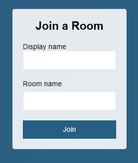

# NodeJS SockerIO Example
Simple SocketIO Chat Room

## Getting Started
Install dependencies
```
npm install
```

Run project
```
npm start
```
Open your browser at `http://localhost:3000`, type an username and chatroom and Enjoy!  



## How it Works?
NodeJS serves Frontend from `public/` and handles SocketIO backend from `server/`
